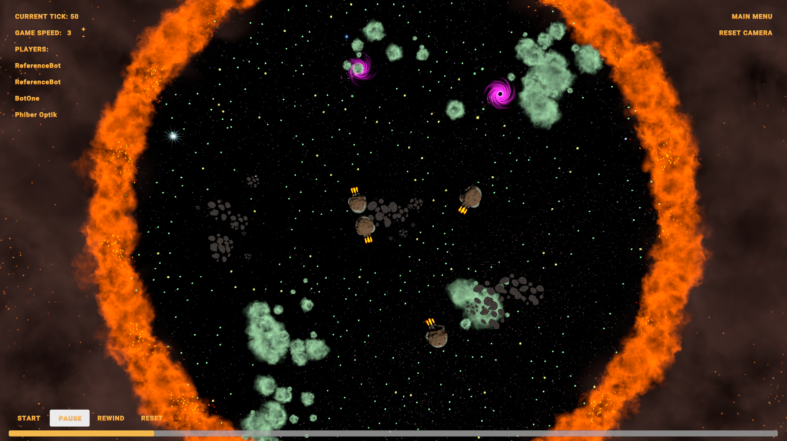

# Tubes1_greed.io
Tugas Besar 1 IF2221 Strategi Algoritma
<br>
Pemanfaatan Algoritma Greedy dalam Aplikasi Permainan Galaxio

## Table of Contents
* [General Information](#general-information)
* [Greedy Algorithm](#greedy-algorithm-implementation)
* [Tech Stack](#tech-stack)
* [How To Run](#how-to-run)
* [Project Structure](#project-structure)
* [Author](#author)


## General Information

Galaxio adalah sebuah game battle royale yang mempertandingkan bot kapal anda dengan beberapa bot kapal yang lain. Setiap pemain akan memiliki sebuah bot kapal dan tujuan dari permainan adalah agar bot kapal anda yang tetap hidup hingga akhir permainan. Penjelasan lebih lanjut mengenai aturan permainan akan dijelaskan di bawah. Agar dapat memenangkan pertandingan, setiap bot harus mengimplementasikan strategi tertentu untuk dapat memenangkan permainan.

## Greedy Algorithm Implementation
Greedy pada pengerjaan bot ini dibagi ke dalam 4 potongan mode yakni <strong> <em> defensive, offensive, priority scale, dan mixed. </em></strong>
### Solusi Greedy Defensive
Implementasi dari solusi ini terbagi menjadi dua jenis yakni defend dengan shield dan afterburner.  Afterburner sendiri akan dibuka ketika ada bot lawan yang mendekat dalam radius konstanta tertentu. Arah hindar ditentukan dari angle lawan ditambah konstanta derajat tertentu sehingga bot tersebut tetap berputar ke dalam arena. Afterburner sendiri akan mati apabila telah teridentifikasi aman dengan mempertimbangkan jarak kedua bot dan ukuran bot. Defend dengan menggunakan shield akan diaktifkan apabila terdapat salvo yang mendekat dalam radius konstanta yang telah ditentukan. 
### Solusi Greedy Offensive
Pemain akan selalu berusaha untuk melakukan serangan pada musuh jika ukuran suatu pemain melewati threshold. Jika ukuran pemain melebih threshold, pemain akan menembakkan SALVO atau TELEPORTER jika musuh berada pada radius yang valid. 
### Solusi Greedy Skala Prioritas
Implementasi dari solusi ini lebih kompleks dari dua alternatif solusi sebelumnya, dimana pada suatu tick tertentu akan ada urutan skala prioritas yang akan ditentukan.
### Solusi Greedy Campuran
Implementasi dari solusi ini adalah gabungan dari implementasi solusi pertama dan kedua, dimana algoritma greedy yang bersifat offensive dan defensive sama-sama digunakan. Pada implementasi ini, terdapat 5 jenis “mode” yang dapat dipilih pada suatu waktu, yaitu mode eat, attack, escape, dan defend.
Pada mode eat, pemain akan fokus untuk mencari FOOD atau SUPERFOOD yang berjarak paling dekat dari pemain. 
Pada mode attack, pemain akan menembak salvo jika pemain berada pada suatu konstanta firing range dan jika terdapat pemain yang lebih kecil dari kita, maka kita akan mengejar pemain tersebut. Selain itu, mode ini juga mempertimbangkan apakah sebaiknya kita melakukan aksi teleport agar dapat memakan lawan dengan melihat situasi pada saat tersebut.
Pada mode escape, pemain akan berusaha untuk kabur dari pemain lawan jika pemain lawan sedang mendekati pemain.
Pada mode defend, pemain akan mengaktifkan SHIELD untuk melindungi pemain dari serangan SALVO lawan.

## Tech Stack
1. For Building
- IntelliJ IDEA Community Edition 2022.3.2
- Apache Maven 3.9.0
2. To run
- Java 18.0.2.1 (min 11)
- .Net 7.0.102 (Untuk yang selanjutnya dapat mengikuti link yang diberikan ketika menjalankan program.)

Untuk cara instalasi dapat dilakukan dengan pencarian dalam browser masing dan melakukan download dapat berupa zip maupun sdk. Apabila zip dapat ditambahkan bin pathnya ke path environment device.

## How To Run
1. Building Program
<br>
- Apabila menggunakan maven, pada bagian terminal (recommended ```powershell```), run
``` shell
mvn clean package
```
- Apabila menggunakan IntelliJ

2. Run Manually
- First Terminal, run
``` shell
cd ./runner-publish/
dotnet GameRunner.dll 
```
- Second Terminal, run
``` shell
cd ./engine-publish/
sleep 1
dotnet Engine.dll 
```
- Third Terminal, run
``` shell
cd ./logger-publish/
sleep 1
dotnet Logger.dll
```
- Forth Terminal and Next Terminal (Until All Player Slot Is Filled), run
``` shell
cd ./reference-bot-publish/ // you can use other directory
sleep 3
dotnet ReferenceBot.dll // if you are using jar then u can insert "java -jar path" to the terminal
```

## Project Structure
```bash
.
│   
├─── README.md
│
├─── Dockerfile
│
├─── pom.xml
│
├─── target
│       │
│       └─── JavaBot.jar
├─── attribute
│       │
│       └─── Galaxio.png
│
├─── doc
│     │
│     └─── greed.io.pdf
│
└─── src
      │
      └─── main
             |
             └─── java
                    |
                    ├─── Enums
                    |      |
                    |      ├─── EffectTypes.java
                    |      |
                    |      ├─── ObjectTypes.java
                    |      |
                    |      └─── PlayerActions.java
                    |
                    ├─── Models
                    |      |
                    |      ├─── GameObject.java
                    |      |
                    |      ├─── GameState.java
                    |      |
                    |      ├─── FameStateDto.java
                    |      |
                    |      ├─── PlayerAction.java
                    |      |
                    |      ├─── Position.java
                    |      |
                    |      └─── World.java    
                    |
                    ├─── Services
                    |      |
                    |      └─── BotService.java
                    |
                    └─── Main.java
```

## Author
Kelompok -- greed.io 
1. Wilson Tansil -- 13521054
2. Frankie Huang -- 13521092
3. William Nixon -- 13521123
